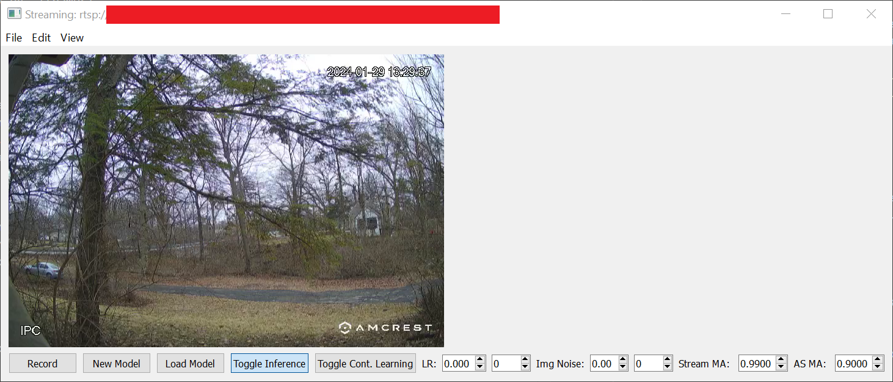
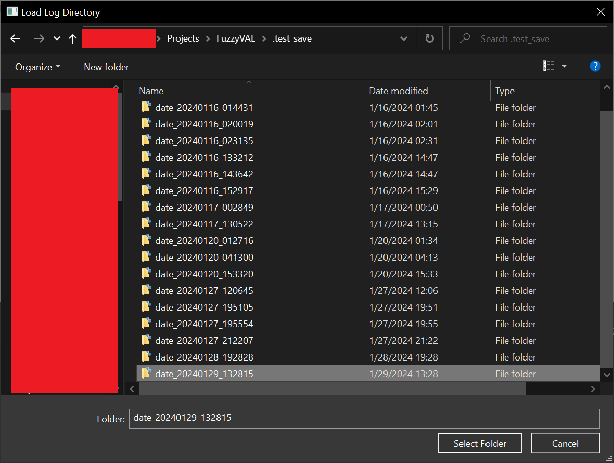
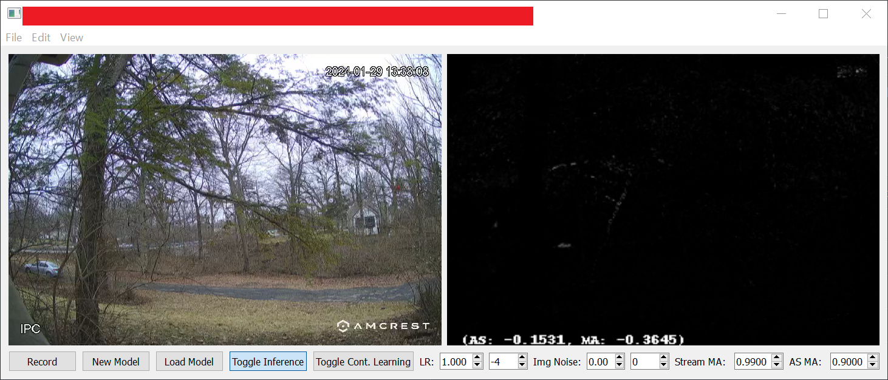
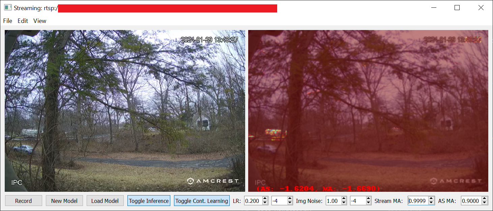

# Kurtosis CVAE - Computer Vision Anomaly Detection

Author: William M. Boler
Group: MICV3D / Purdue University, Indianapolis (PUI)

## Description

This project implements a variational autoencoder using Python, Tensorflow, and Anaconda.  A VAE model is constructed using the `KurtosisGlobalCVAE` object, which implements a loss function as MSE for image reconstruction, Kurtosis Regularization for latent-space distribution-matching regularization, and L1 error of the latent vector. Gaussian noise is applied to both the input image and the latent space at training time only, and encoder-decoder models use CNN layers. The latent vector is a single dense vector, comprised of a combination of mean and standard deviation vectors approximated by the encoder network.  Code exists for training, evaluating, interpolation/extrapolation, UMAP latent space reduction, decoder generation, anomaly detection, and live-camera streaming.

**UNDER CONSTRUCTION**: The repository is highly disorganized at this time, as it mainly started off as a side project to evaluate VAE loss functions under my own repo.  It has since transformed into the primary focus of my research for anomaly detection in video streaming applications.

## Environment Setup

The project uses Anaconda to manage the environment, but one can choose how to implement their environment.  I will give a quick walkthrough on how I have set up the project for my own use case, which mostly works on both Linux and Windows (some hiccups with Windows).

### Dependencies

Before getting started, the repo primarily takes advantage of TensorFlow and CUDA.  All python packages and libraries are handled in the YAML config file `env.yml`, but before getting started, one needs to install the actual Nvidia drivers, CUDA drivers, and package manager system.  So, the project depends on the following prior to the `conda` install:

* Anaconda (using `conda` v23.10.0)
* CUDA Toolkit 11.2
* CuDNN 8.1

I believe that later versions of CUDA are backwards compatible with earlier toolkits, so for my own system I have CUDA v12.3, Nvidia Driver 545.84.  After installing those drivers, the Anaconda package manager will handle the rest.

### Anaconda Environment

After installing all relevant drivers and dependencies, one can simply setup the Anaconda environment with the following call:

```
& conda create env -f .\config.yml
& conda activate lse
```

The conda environment name `lse` was arbitrarily chosen and can be changed at creation time by passing the `-n` flag.

# Training

The code for training a model is contained in `train.py`.  It expects a configuration file, as outlined below, which contains a path to the dataset directory (must be modified by you), loss function, model, and training parameters. The type of acceptable datasets are described in the next section, including how to create one from a set of PNG files. 

My method for executing training is to create a sandbox directory, and call the train code from within the sandbox.  This is not necessary, but very helpful with organization, especially if you're working with larger datasets that should be stored on a larger drive. The output of `train.py` produces a `logs` directory, which outputs the model, evaluation, and other information into a directory as `.\logs\date_%Y%m%d_%H%M%S\`. 

```
& mkdir sandbox
& <create sandbox\config.yml>
& cd .\sandbox
& python ..\train.py .\config.yml
```

__Example YAML config.yml__

```yaml
data:
  dataset: raite
  dataset_path: <path to dataset containing .\frames and .\*_labels.json directory of png files>
  image_size:
  - 224
  - 300
  - 3
  train_split: train_labels.json
  val_split: val_labels.json

loss:
  kurtosis: 3.0
  w_kl_divergence: 0.0
  w_kurtosis: 1E-3
  w_mse: 1.0
  w_skew: 0.0
  w_x_std: 1E-10
  w_z_l1_reg: 1E-3

model:
  encoder_dense_filters: 16
  decoder_dense_filters: 32
  latent_dimensions: 32
  layers:
  - 32
  - 5

training:
  batch_size: 16
  beta: 1E-6
  learning_rate: 1E-4
  max_epochs: 1000
  ```

  ## Dataset Construction

  There are several methods for creating a dataset.  The primary method for fastest training is to use TensorFlow Datasets. So, the data loader can handle the receipt of a TensorFlow Dataset file, as long as an entry has an "images" fieldname (TODO: verify this keyword). Otherwise, the code can create a TensorFlow Dataset object from a COCO JSON annotations file.  

  Given a directory containing PNG files, one can construct a dataset by executing the `build_raite_json_from_directory.py`.  The reason for the naming scheme is due to a RAITE event it was created for, but in reality it is constructing a COCO JSON file.  What it does not do is populate the `annotations` field of the JSON dictionary, as the VAE does not use annotations. 

  ```
  & cd .\data\my_image_files\
  & python ..\..\build_raite_json_from_directory.py .\frames\
  ```

  After execution, the labels will be found in `.\data.\my_image_files\labels.json`.  At this point, one would modify their YAML configuration file to point to the full path for `.\data\my_image_files\`. 

  __NOTE__: The code does not currently separate data into training, validation, and test splits.  One could do so by manually separating data contained in the JSON label to their own separate label files, such as `.\data\my_image_files\train_labels.json` and `.\data\my_image_files\val_labels.json`, then modifying the YAML config to point to `train_labels.json` for training and `val_labels.json` for validation. 

  ## Camera Streaming

  Code exists to stream a RTSP camera through the model in `camera_streamer_qt.py`.  The code was written pre-dating a good understanding of RTSP streams, so it attempts to automatically construct one with the passed arguments.  So, these arguments should be ignored for now (TODO) and only the `--rtsp-overide` argument should be passed.  Furthermore, the streaming camera can only be set at the start of application, which is due to change in the future (TODO). 

  ```
  & python .\camera_streamer_qt.py asdf --rtsp-overide "rtsp:\\admin:passwd@192.198.0.202"
  ```

  This command will bring up the Qt application as shown. Ignore the RED bar, due to display of raw RTSP stream information. 

  

  ### Load a Trained Model

  We can load a model directly from the `train.py` output log directory by pressing the `Load Model` button. This will bring up a directory load GUI.  Navigate to the model directory you wish to output, and click Select Folder. 

  

  

  The loaded model should now be inferring on the streaming camera visualization. 

  ### Continuous Learning

  To implement continuous learning, simply click the `Toggle Cont. Learning`` button.  Parameters can be changed on the dials to the right of the button, primarily learning rate 0.2E-4, img noise 1.0E-4, stream ma: 0.9999, as ma: 0.9000.  
  
  We can also change the output of the anomaly detection stream through the `View` dropdown menu.  The options are to display reconstruction, heatmap overlay, and the raw JET heatmap.  Reconstruction always overrides other options.  To go back to black and white, unselect all options. 

